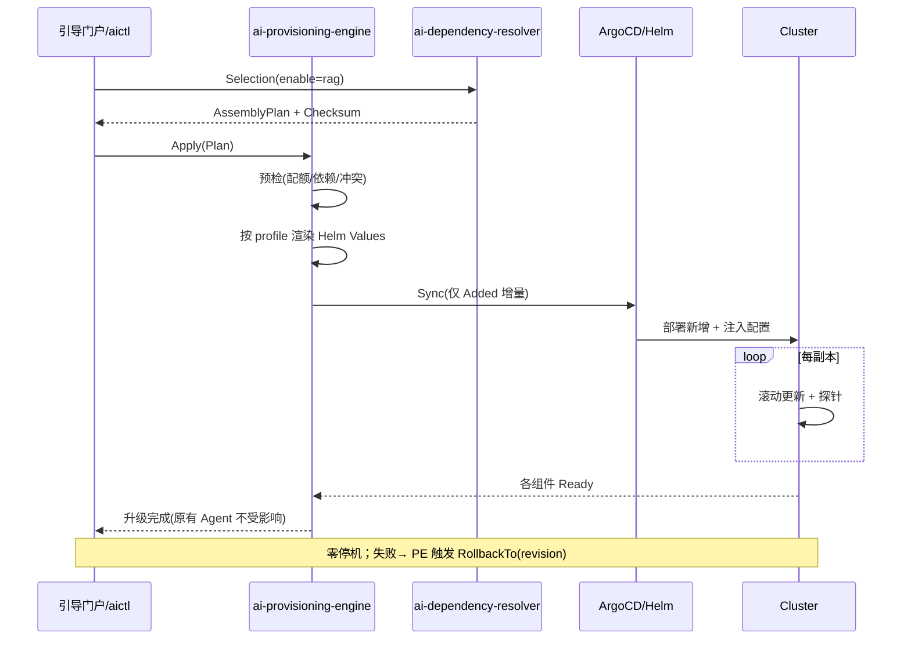

# ai-provisioning-engine · 详细设计

> **repo**: ai-provisioning-engine
> **语言·框架**: Go · Gin + Cobra + Wire（DDD 四层；执行编排热路径可上 Hertz/go-zero）
> **领域**: assembly（装配域 · 供给/部署引擎）
> **optional**: false（核心 · core，引导门户/装配中枢）
> **平台版本**: v1.4.0
> **文档状态**: 草稿
> **负责人**: OpenStrata 架构组
> **关联链接**: 本仓 [arch/ARCH.md](../../arch/ARCH.md) · [skills/SKILLS.md](../../skills/SKILLS.md) · [specs/SPECS.md](../../specs/SPECS.md) ；架构设计文档 §13.3（依赖感知自动升级 · Provisioning Engine）· §13.5（回滚与安全）· §9（K8s 部署）· §10.4（SPI 多实现）· §12.2（四档预制）· §15.6（DDD 分层）· §16（BOM）

---

## 1. 定位与边界（Scope）

`ai-provisioning-engine` 是 OpenStrata 装配中枢的**后半程**：部署/供给引擎（§13.3 显式拆分）。它消费 `ai-dependency-resolver` 产出的 **AssemblyPlan**，把计划落地为 **Helm Values / Compose / Operator 配置**，并通过 **ArgoCD 或直连 Helm** 应用到运行环境，落实「增量部署、滚动更新、零停机」（§13.3 三原则）。

- **本仓解决的唯一问题**：把"一份确定的装配计划"变成"对环境的安全、可观测、可回滚的实际变更"——只动差异部分，已运行服务不重启。
- **必选性**：core（§13.3 装配中枢）。阶段一~三由 `aictl up` 驱动 Compose；full 档由引导门户 + ArgoCD GitOps 驱动。
- **与其他 Go 组件的分工**：
  - **vs ai-dependency-resolver**：本仓**只执行、不算依赖**（§13.3）。Resolver 产出 Plan → 本仓消费 Plan。
  - **vs ai-cli**：`aictl up/apply` 是调用方；CLI 透传 Plan 或触发本地 Compose。
  - **vs ai-guide-portal**：门户触发执行编排，本仓是执行内核（§13.1 EXEC）。
  - **vs 被部署组件（gateway/sandbox 等）**：本仓是它们的"装配者"，不直接调用其运行时。

---

## 2. 职责清单

| # | 职责 | 必选/可选 | 说明 |
| --- | --- | --- | --- |
| R1 | Plan 消费与校验 | core | 读取 AssemblyPlan，预检资源/依赖（§13.5） |
| R2 | 渲染配置 | core | Plan → Helm Values / Compose / Operator（按 profile） |
| R3 | 增量部署 | core | 仅部署/变更差异（§13.3 原则二） |
| R4 | 滚动更新 | core | 多副本滚动 + 探针保活（§13.3, §9） |
| R5 | 灰度升级 | core | 影响面大者双写校验后切（§13.5） |
| R6 | 回滚 | core | 声明式回滚（enabled=false 重放，§13.5） |
| R7 | 状态回传 | core | 组件 Ready 状态回传门户（§13.1） |

---

## 3. 核心抽象与接口（core interfaces / 类型定义）

领域层（§15.6.2 `domain/`）定义执行 Port 与渲染模型。

```go
package domain

// ===== 消费 AssemblyPlan（来自 resolver）=====
type AssemblyPlan struct {
    Added, Reused, Removed []PlannedComponent
    Checksum string
}

// ===== 渲染产物 =====
type RenderOutput struct {
    Kind     string // helm-values | compose | k8s-manifest
    Artifacts map[string][]byte // 文件名 -> YAML
}

// ===== 执行结果 =====
type ApplyResult struct {
    Component string
    Action    string // add|reuse|remove|rolling-update
    Status    string // success|failed|in-progress
    Message   string
}

// ===== 部署目标 Port（SPI: CICD 1.0.0）=====
type Deployer interface {
    Render(ctx context.Context, plan AssemblyPlan, profile string) (RenderOutput, error)
    Apply(ctx context.Context, out RenderOutput) ([]ApplyResult, error)
    Rollback(ctx context.Context, component string, toVersion string) error
    Status(ctx context.Context, component string) ComponentStatus
}

type ComponentStatus struct {
    Name    string
    Ready   bool
    Version string
    Replicas int
}

// ===== CICD SPI（interface_versions.CICD = 1.0.0）=====
// ArgoCD / Istio 等实现的统一部署端口
type CICDPort interface {
    Sync(ctx context.Context, manifest []byte) error
    RollbackTo(ctx context.Context, revision string) error
}
```

---

## 4. 处理流水线 / 请求路径（输入→依赖展开→计划生成→执行）

> 输入侧「依赖展开/计划生成」由 `ai-dependency-resolver` 完成（见其 §4）；本仓从 Plan 开始：

```mermaid
flowchart TD
    A[门户/aictl] -->|"AssemblyPlan + Checksum"| B[ai-provisioning-engine]
    B --> C[预检: 资源配额 + 依赖图 + 冲突]
    C -->|"失败"| ERR[阻断 + 原因]
    C -->|"通过"| D[按 profile 渲染<br/>Helm Values/Compose/Operator]
    D --> E[差量应用: 仅 Added/Removed/变更]
    E --> F{组件类型}
    F -->|"多副本"| G[滚动更新<br/>maxSurge/maxUnavailable + 探针]
    F -->|"影响面大"| H[双写校验后切(灰度)]
    F -->|"移除"| I[声明式下线(enabled=false)]
    G --> J[探测 Ready]
    H --> J
    J -->|"未 Ready"| RETRY[重试/超时→回滚]
    J -->|"Ready"| K[状态回传门户]
    K --> L[完成，原有服务零停机]
```

---

## 5. 关键算法 / 逻辑

### 5.1 渲染（Plan → 配置）
按 `profile`（starter=Compose；standard+/advanced/full=Helm/K8s）选择渲染器；从 bom.yaml 取钉死版本、从 repos.yaml 取自研 tag，注入 `infrastructure/config/` 局部片段（§15.7）+ 元仓 `dependencies/config/` 组合级范例（如 higress.yaml），合成最终 Values。

### 5.2 增量应用
仅对 `Plan.Added` 部署、`Plan.Removed` 下线、`Plan.Reused` 跳过（§13.3 原则二）。已运行服务**不重启**（除非其配置在 Plan 中变更，才滚动）。

### 5.3 滚动更新
多副本组件用 `maxSurge:1/maxUnavailable:0` + 存活/就绪探针，逐批替换（§9、§13.3）。

### 5.4 灰度升级
影响面大的切换（如切向量库 Milvus↔Qdrant，§13.5）走**双写校验后再切**：先并行写两份、校验一致性、再切流量，属非零停机、需运维窗口（§15.3 风险）。

### 5.5 回滚
声明式：把某项 `enabled` 改回 `false`/旧版本并重放 Plan，ArgoCD/GitOps 自动回滚（§13.5）。本仓记录每次 Apply 的 revision 以便精确回滚。

---

## 6. 与外部系统/组件的适配（OSS / SPI Adapter）

| SPI 端口 | 本仓角色 | 外部组件（bom.yaml） | 默认 ✅ / 备选 | Adapter |
| --- | --- | --- | --- | --- |
| `CICD` (1.0.0) | 消费方 | ArgoCD（optional）+ Istio（optional，仅阶段四 full） | 备选 / 备选 | `ArgoCDAdapter`（GitOps sync/rollback） |
| `Cache` (1.0.0) | 消费方 | Redis（core） | ✅ | 执行状态/锁 |
| `Tracing` (1.0.0) | 消费方 | OTel（core） | ✅ | 部署链路 trace |
| 部署目标 | 直接驱动 | Kubernetes（Helm/Kubectl）/ Docker Compose | ✅ | `HelmAdapter` / `ComposeAdapter` |

> **CICD 默认关**：ArgoCD/Istio 为 optional（仅 full 档，§12.2），故本仓在 starter/standard/advanced 走直连 Helm/Compose，full 档走 ArgoCD（SPI 多实现并存，§10.4）。防腐层：所有部署目标经 Adapter 隔离，切换零改动（§15.6.4）。
> 版本钉死与 bom.yaml `interface_versions` 对齐：渲染时按各组件钉死版本（§16.1）。

---

## 7. API / CLI / 配置接口面

### 7.1 HTTP API（Gin，供门户/Resolver 调用）
```
POST /v1/apply            # 提交 AssemblyPlan，执行
POST /v1/rollback         # 回滚组件到 revision
GET  /v1/status/{component}
GET  /v1/plan/{checksum}/apply-result
GET  /healthz  /metrics
```
### 7.2 CLI（经 `ai-cli` 透传）
```
aictl up --profile starter          # 渲染 Compose + 拉起核心组件
aictl apply --plan <checksum>       # 应用某 Plan
aictl rollback --component ai-sandbox-manager
```
### 7.3 配置片段（本仓 `infrastructure/config/`）
```yaml
provisioner:
  mode: helm            # helm | compose | argocd
  argocd:
    enabled: false      # full 档置 true
    namespace: ai-system
  rollout:
    maxSurge: 1
    maxUnavailable: 0
    probeGraceSeconds: 30
  grayCutover:
    doubleWriteVerify: true   # 影响面大切换走双写校验
  metaRepo:
    profilesPath: openstrata-meta/profiles
    configPath: openstrata-meta/dependencies/config
```

---

## 8. 数据模型与存储

- **执行记录**：PostgreSQL（core）记录每次 Apply 的 Plan/组件/revision/状态，支撑回滚与审计（§13.5）。
- **Redis**：执行锁（防并发改同一组件）、状态缓存。

```sql
CREATE TABLE provisioning_record (
  id          BIGSERIAL PRIMARY KEY,
  plan_checksum TEXT,
  component   TEXT,
  action      TEXT,
  revision    TEXT,
  status      TEXT,
  created_at  TIMESTAMPTZ DEFAULT now()
);
```

---

## 9. 并发与性能（goroutine / pool / 背压）

- **框架**：Gin 管理 API；执行编排热路径可上 Hertz/go-zero（§15.6.1）。
- **并发应用**：多个 `Added` 组件可**并行部署**（每组件一 goroutine + WaitGroup），但共享依赖（如先 PG 后依赖它的服务）按拓扑顺序编排。
- **背压/锁**：同一组件并发 Apply 用 Redis 分布式锁串行化；全局并发度受信号量限制，避免压垮 API Server。
- **可观测进度**：每组件状态经 `chan` 上报，门户实时看板（§13.1 状态看板）。
- **无状态**：执行面无状态可水平扩；执行记录落库。

---

## 10. 关键时序图（Mermaid）



---

## 11. 配置与部署（含 K8s 资源/探针）

- **部署形态**：core，部署于 `ai-system` 命名空间（§9.2）；full 档经由 ArgoCD 自身管理（GitOps 自举）。
- **资源**（参考）：requests cpu 200m / mem 256Mi；limits cpu 1 / mem 1Gi。
- **探针**：存活 `GET /healthz`；就绪 `GET /healthz`（校验 K8s/ArgoCD 可达）。`initialDelaySeconds: 5`，period `10s`。
- **滚动更新**：多副本 + 探针（§13.3）。
- **可选性**：core；其驱动的 CICD（ArgoCD/Istio）为 optional（full 档点亮，profiles `optional_disabled` 控制）。

---

## 12. 可观测性 / 安全

- **可观测性（§4.8）**：基础 OTel traces + 审计（core）；Prometheus（apply 次数、耗时、各组件 Ready 时间、回滚次数、失败率）。
- **安全（§13.5 / §4.7.4）**：执行属平台自身变更，全量审计（即便 `security` 未开也留痕）；升级预检失败即阻断；ArgoCD RBAC 限定其只动 `ai-system`/租户命名空间。

---

## 13. 测试策略

- **单元测试**：渲染器（Plan→Values 字段正确）、差量计算、滚动策略、回滚逻辑（领域层纯逻辑，§15.6.5）。
- **SPI 契约测试**：HelmAdapter/ComposeAdapter/ArgoCDAdapter 跑同一「apply/rollback/status」契约，保证多实现一致（§10.4）。
- **集成测试**：起 kind 集群 +  mock ArgoCD，验证增量部署不重启复用组件、滚动更新探针生效、回滚到旧 revision。
- **混沌测试**：部署中途杀掉某组件 Pod，验证重试/超时→回滚且不破坏其余组件。
- **快照测试**：对四档 profile 渲染输出做 golden file 比对（对齐 §12.2）。

---

## 14. 开放问题

1. **ArgoCD 自举时机**：full 档本仓经 ArgoCD 管理，但 ArgoCD 本身如何首次落地（bootstrap）？需明确 chicken-egg。
2. **双写迁移的归属**：§13.5 向量库切换的双写校验由本仓还是专用迁移 Job 执行？Resolver 是否需产出"迁移型 Plan"？
3. **并发 Apply 的全局顺序**：多租户同时升级时，共享组件（如 PG）的升级如何协调、避免冲突？
4. **Helm Values 与局部 config 的合并策略**：元仓 `dependencies/config/` 与 App 仓 `infrastructure/config/` 冲突时优先级？需与 §15.7 对齐。
5. **回滚的语义边界**：回滚组件是否级联回滚其依赖？需定义最小回滚集。

---

## 变更记录

| 版本 | 日期 | 作者 | 说明 |
| --- | --- | --- | --- |
| v0.1 | 2026-07-17 | OpenStrata 架构组 | 初稿（覆盖占位骨架，14 节完整） |

## 追溯矩阵（本文档章节 ↔ 架构设计文档 § 编号）

| 章节 | 对应架构 § |
| --- | --- |
| 1 定位与边界 | §13.3, §15.6 |
| 2 职责清单 | §13.1, §13.3, §13.5 |
| 3 核心抽象与接口 | §10.4, §13.3, §16 |
| 4 处理流水线 | §13.3 |
| 5 关键算法 | §9, §12.2, §13.3, §13.5, §15.3, §15.7 |
| 6 外部适配 | §10.4, §12.2, §15.6.4, §16 |
| 7 API/CLI/配置 | §12.2, §13.4 |
| 8 数据模型 | §13.5, §16(base) |
| 9 并发与性能 | §13.3, §15.6.1, §15.6.5 |
| 10 时序图 | §13.3, §15.6.2.2 |
| 11 配置部署 | §9.1, §9.2, §12.2, §13.3 |
| 12 可观测性/安全 | §4.7.4, §4.8, §13.5 |
| 13 测试策略 | §10.4, §12.2, §15.6.5 |
| 14 开放问题 | §12.2, §13.5, §15.3, §15.7 |
