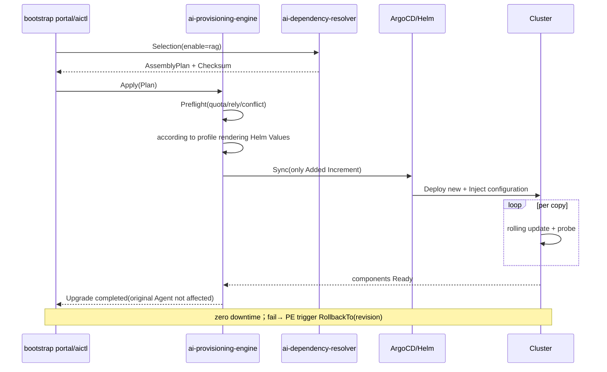

# ai-provisioning-engine · Detailed design

> **repo**: ai-provisioning-engine
> **Language · Framework**: Go · Gin + Cobra + Wire (DDD four layers; the hot path for execution and orchestration can be Hertz/go-zero)
> **Domain**: assembly (assembly domain · provisioning/deployment engine)
> **optional**: false (core · core, boot portal/assembly hub)
> **Platform version**: v1.0.0
> **Document Status**: Draft
> **Responsible Person**: OpenStrata Architecture Group
> **Associated links**: This repository [arch/ARCH.md](../../arch/ARCH.md) · [skills/SKILLS.md](../../skills/SKILLS.md) · [specs/SPECS.md](../../specs/SPECS.md); Architecture design document §13.3 (Dependency-aware automatic upgrade · Provisioning Engine) · §13.5 (Rollback and Security) · §9 (K8s Deployment) · §10.4 (SPI Multiple Implementation) · §12.2 (Four-Level Prefabrication) · §15.5 (DDD Layering) · §16 (BOM)

---

## 1. Positioning and Boundary (Scope)

`ai-provisioning-engine` is the **second half** of the OpenStrata assembly hub: the deployment/provisioning engine (§13.3 explicit split). It consumes the **AssemblyPlan** produced by `ai-dependency-resolver`, implements the plan into **Helm Values ​​/ Compose / Operator configuration**, and applies it to the running environment through **ArgoCD or direct connection to Helm**, implementing "incremental deployment, rolling update, zero downtime" (§13.3 Three Principles).

- **The only problem solved by this repository**: Turn "a confirmed assembly plan" into "actual changes to the environment that are safe, observable, and rollable" - only the difference parts are moved, and running services are not restarted.
- **Required**: core (§13.3 Assembly hub). Stages one to three are driven by `aictl up` to drive Compose; the full file is driven by the boot portal + ArgoCD GitOps.
- **Division of labor with other Go components**:
- **vs ai-dependency-resolver**: This repository ** only executes and does not count as a dependency** (§13.3). Resolver output plan → own repository consumption plan.
- **vs ai-cli**: `aictl up/apply` is the caller; CLI transparently transmits Plan or triggers local Compose.
- **vs ai-guide-portal**: The portal triggers execution orchestration, and this repository is the execution core (§13.1 EXEC).
- **vs deployed components (gateway/sandbox, etc.)**: This repository is their "assembler" and does not directly call their runtime.

---

## 2. Responsibilities List

| # | Responsibilities | Required/Optional | Description |
| --- | --- | --- | --- |
| R1 | Plan consumption and verification | core | Read AssemblyPlan, pre-check resources/dependencies (§13.5) |
| R2 | Rendering Configuration | core | Plan → Helm Values ​​/ Compose / Operator (by profile) |
| R3 | Incremental deployment | core | Deployment/change differences only (§13.3 Principle 2) |
| R4 | rolling update | core | multi-copy rolling + probe keepalive (§13.3, §9) |
| R5 | Canary upgrade | core | Those with greater impact will be cut after double-writing verification (§13.5) |
| R6 | rollback | core | declarative rollback (enabled=false replay, §13.5) |
| R7 | Status Postback | core | Component Ready Status Postback Portal (§13.1) |

---

## 3. Core abstraction and interface (core interfaces / type definition)

The domain layer (§15.5.2 `domain/`) defines the execution port and rendering model.

```go
package domain

//===== Consume AssemblyPlan (from resolver) =====
type AssemblyPlan struct {
    Added, Reused, Removed []PlannedComponent
    Checksum string
}

//===== Rendering products =====
type RenderOutput struct {
    Kind     string // helm-values | compose | k8s-manifest
    Artifacts map[string][]byte //Filename -> YAML
}

//===== Execution results =====
type ApplyResult struct {
    Component string
    Action    string // add|reuse|remove|rolling-update
    Status    string // success|failed|in-progress
    Message   string
}

//===== Deployment target Port (SPI: CICD 1.0.0) =====
type Deployer interface {
    Render(ctx context.Context, plan AssemblyPlan, profile string) (RenderOutput, error)
    Apply(ctx context.Context, out RenderOutput) ([]ApplyResult, error)
    Rollback(ctx context.Context, component string, toVersion string) error
    Status(ctx context.Context, component string) ComponentStatus
}

type ComponentStatus struct {
    Name    string
    Ready   bool
    Version string
    Replicas int
}

// ===== CICD SPI（interface_versions.CICD = 1.0.0）=====
//Unified deployment port implemented by ArgoCD/Istio etc.
type CICDPort interface {
    Sync(ctx context.Context, manifest []byte) error
    RollbackTo(ctx context.Context, revision string) error
}
```

---

## 4. Processing pipeline/request path (input → dependency expansion → plan generation → execution)

> The input side "dependency expansion/plan generation" is completed by `ai-dependency-resolver` (see §4); this repository starts from Plan:

```mermaid
flowchart TD
    A[portal/aictl] -->|"AssemblyPlan + Checksum"| B[ai-provisioning-engine]
    B --> C[Preflight: Resource quota + dependency graph + conflict]
    C -->|"fail"| ERR[block + reason]
    C -->|"pass"| D[according to profile rendering<br/>Helm Values/Compose/Operator]
    D --> E[differential application: only Added/Removed/change]
    E --> F{Component type}
    F -->|"Multiple copies"| G[rolling update<br/>maxSurge/maxUnavailable + probe]
    F -->|"Big impact"| H[Cut after double-write verification(canary)]
    F -->|"remove"| I[Declarative offline(enabled=false)]
    G --> J[detection Ready]
    H --> J
    J -->|"Not Ready"| RETRY[Try again/time out→rollback]
    J -->|"Ready"| K[Status callback portal]
    K --> L[Finish，Zero downtime for original services]
```

---

## 5. Key algorithm/logic

### 5.1 Rendering (Plan → Configuration)
Select the renderer according to `profile` (starter=Compose; standard+/advanced/full=Helm/K8s); take the nailed version from bom.yaml, take the self-developed tag from repos.yaml, inject `infrastructure/config/` local fragments (§15.6) + meta repository `dependencies/config/` combination-level examples (such as higress.yaml), and synthesize the final Values.

### 5.2 Incremental application
Only `Plan.Added` is deployed, `Plan.Removed` is offline, and `Plan.Reused` is skipped (§13.3 Principle 2). Running services are not restarted (unless their configuration is changed in Plan, they are rolled).

### 5.3 Rolling update
Multi-copy components are replaced batch by batch with `maxSurge:1/maxUnavailable:0` + liveness/readiness probes (§9, §13.3).

### 5.4 Canary upgrade
Switches with a large impact (such as switching the vector library Milvus↔Qdrant, §13.5) are done by **double-writing verification before switching**: first write two copies in parallel, verify consistency, and then cut over traffic, which is a non-zero downtime and requires an operation and maintenance window (§15.3 risk).

### 5.5 Rollback
Declarative: Change an item's `enabled` back to `false`/old version and replay Plan, ArgoCD/GitOps automatically rolls back (§13.5). This repository records each Apply revision for accurate rollback.

---

## 6. Adaptation with external systems/components (OSS/SPI Adapter)

| SPI port | Role of this repository | External component (bom.yaml) | Default ✅ / Alternative | Adapter |
| --- | --- | --- | --- | --- |
| `CICD` (1.0.0) | Consumer | ArgoCD (optional) + Istio (optional, only phase four full) | Alternative / alternative | `ArgoCDAdapter` (GitOps sync/rollback) |
| `Cache` (1.0.0) | Consumer | Redis (core) | ✅ | Execution status/lock |
| `Tracing` (1.0.0) | Consumer | OTel (core) | ✅ | Deployment link trace |
| Deployment target | Direct driver | Kubernetes (Helm/Kubectl) / Docker Compose | ✅ | `HelmAdapter` / `ComposeAdapter` |

> **CICD default off**: ArgoCD/Istio is optional (only full file, §12.2), so this repository uses direct connection to Helm/Compose in starter/standard/advanced, and uses ArgoCD in full file (multiple SPI implementations coexist, §10.4). Anti-corrosion layer: All deployment targets are isolated by Adapter, and there is zero change when switching (§15.5.4).
> Version pinning is aligned with bom.yaml `interface_versions`: versions are pinned per component when rendering (§16.1).

---

## 7. API / CLI / Configuration interface

### 7.1 HTTP API (Gin, called by portal/Resolver)
```
POST /v1/apply            #Submit AssemblyPlan and execute
POST /v1/rollback         #Roll back a component to revision
GET  /v1/status/{component}
GET  /v1/plan/{checksum}/apply-result
GET  /healthz  /metrics
```
### 7.2 CLI (via `ai-cli` pass-through)
```
aictl up --profile starter          #Render Compose + pull up core components
aictl apply --plan <checksum>       #Apply a Plan
aictl rollback --component ai-sandbox-manager
```
### 7.3 Configuration fragment (this repository `infrastructure/config/`)
```yaml
provisioner:
  mode: helm            # helm | compose | argocd
  argocd:
    enabled: false      #full profile true
    namespace: ai-system
  rollout:
    maxSurge: 1
    maxUnavailable: 0
    probeGraceSeconds: 30
  grayCutover:
    doubleWriteVerify: true   #Switching to double-write verification will have a huge impact.
  metaRepo:
    profilesPath: openstrata-meta/profiles
    configPath: openstrata-meta/dependencies/config
```

---

## 8. Data model and storage

- **Execution Record**: PostgreSQL (core) records the Plan/component/revision/status of each Apply, supporting rollback and auditing (§13.5).
- **Redis**: execution lock (to prevent concurrent changes to the same component), status cache.

```sql
CREATE TABLE provisioning_record (
  id          BIGSERIAL PRIMARY KEY,
  plan_checksum TEXT,
  component   TEXT,
  action      TEXT,
  revision    TEXT,
  status      TEXT,
  created_at  TIMESTAMPTZ DEFAULT now()
);
```

---

## 9. Concurrency and performance (goroutine / pool / back pressure)

- **Framework**: Gin management API; the execution orchestration hot path can be on Hertz/go-zero (§15.5.1).
- **Concurrent Application**: Multiple `Added` components can be deployed **in parallel** (one goroutine + WaitGroup per component), but shared dependencies (such as PG first and then the services that depend on it) are arranged in topological order.
- **Backpressure/Lock**: Concurrent Apply of the same component is serialized using Redis distributed lock; the global concurrency is limited by the semaphore to avoid overwhelming the API Server.
- **Observable progress**: The status of each component is reported through `chan`, and the portal has a real-time dashboard (§13.1 Status Dashboard).
- **Stateless**: The execution surface is stateless and can be expanded horizontally; execution records are dropped into the database.

---

## 10. Key sequence diagram (Mermaid)



---

## 11. Configuration and deployment (including K8s resources/probes)

- **Deployment mode**: core, deployed in the `ai-system` namespace (§9.2); full files are managed by ArgoCD itself (GitOps bootstrapping).
- **Resources** (reference): requests cpu 200m / mem 256Mi; limits cpu 1 / mem 1Gi.
- **Probe**: alive `GET /healthz`; ready `GET /healthz` (verify K8s/ArgoCD is reachable). `initialDelaySeconds: 5`, period `10s`.
- **Rolling Update**: Multiple copies + probes (§13.3).
- **Optional**: core; its driven CICD (ArgoCD/Istio) is optional (full file is on, profiles `optional_disabled` is controlled).

---

## 12. Observability / Security

- **Observability (§4.8)**: basic OTel traces + audit (core); Prometheus (number of apply, time consumption, Ready time of each component, number of rollbacks, failure rate).
- **Security (§13.5 / §4.7.4)**: Perform changes belonging to the platform itself and fully audit (leave traces even if `security` is not turned on); block if upgrade pre-check fails; ArgoCD RBAC limits it to only move the `ai-system`/tenant namespace.

---

## 13. Testing strategy

- **Unit test**: renderer (Plan→Values ​​field is correct), difference calculation, rolling strategy, rollback logic (domain layer pure logic, §15.5.5).
- **SPI contract test**: HelmAdapter/ComposeAdapter/ArgoCDAdapter run the same "apply/rollback/status" contract to ensure consistency among multiple implementations (§10.4).
- **Integration Test**: Start kind cluster + mock ArgoCD, verify that incremental deployment does not restart reused components, rolling update probes take effect, and rollback to old revision.
- **Chaos Test**: Kill a component Pod mid-deployment, verify retry/timeout → rollback without damaging other components.
- **Snapshot test**: Golden file comparison of the four profile rendering outputs (Alignment §12.2).

---

## 14. Open questions

1. **ArgoCD bootstrap timing**: The full file repository is managed by ArgoCD, but how does ArgoCD itself bootstrap for the first time? Need to clarify chicken-egg.
2. **Ownership of double-write migration**: §13.5 Is the double-write verification of vector library switching performed by this repository or a dedicated migration job? Does the Resolver need to produce a "migration plan"?
3. **Global order of concurrent Apply**: When multiple tenants are upgraded at the same time, how to coordinate the upgrade of shared components (such as PG) to avoid conflicts?
4. **Helm Values ​​and local config merging strategy**: What is the priority when the Yuan repository `dependencies/config/` conflicts with the App repository `infrastructure/config/`? Requires alignment with §15.6.
5. **Semantic boundaries of rollback**: Does the rollback component cascade rollback its dependencies? A minimum rollback set needs to be defined.

---

## Change record

| Version | Date | Author | Description |
| --- | --- | --- | --- |
| v0.1 | 2026-07-17 | OpenStrata Architecture Group | First draft (covering the placeholder skeleton, complete with 14 sections) |

## Traceability Matrix (Chapter of this document ↔ Architecture Design Document § Number)

| Chapter | Corresponding Architecture § |
| --- | --- |
| 1 Positioning and Boundaries | §13.3, §15.5 |
| 2 Responsibilities List | §13.1, §13.3, §13.5 |
| 3 Core Abstractions and Interfaces | §10.4, §13.3, §16 |
| 4 Processing Pipeline | §13.3 |
| 5 Key Algorithms | §9, §12.2, §13.3, §13.5, §15.3, §15.6 |
| 6 External adaptation | §10.4, §12.2, §15.5.4, §16 |
| 7 API/CLI/Configuration | §12.2, §13.4 |
| 8 Data Model | §13.5, §16(base) |
| 9 Concurrency and Performance | §13.3, §15.5.1, §15.5.5 |
| 10 Timing diagram | §13.3, §15.5.2.2 |
| 11 Configuration Deployment | §9.1, §9.2, §12.2, §13.3 |
| 12 Observability/Security | §4.7.4, §4.8, §13.5 |
| 13 Testing Strategy | §10.4, §12.2, §15.5.5 |
| 14 Open Questions | §12.2, §13.5, §15.3, §15.6 |
